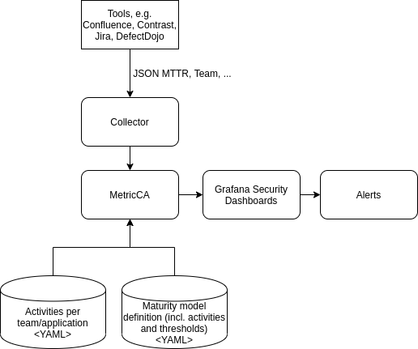
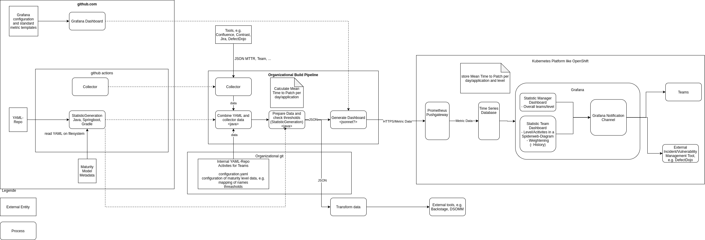
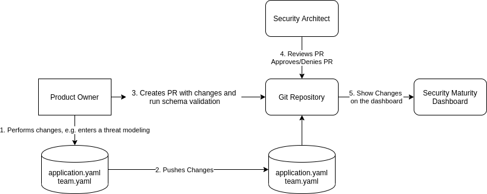
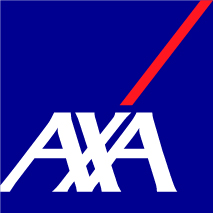

# MetricCA: Your Metrics Collection & Analysis Tool

## Overview

MetricCA is an open-source tool designed to collect, process, and showcase metrics from various development and documentation tools, assisting in keeping a real-time check over the performance and security aspects of your applications.

## Features

- **Manual YAML-based Metrics Collection**: Enabling non-technical folks to manage and modify metrics.
- **Automated Data Collection**: Direct API interactions with platforms like Jira, Confluence, and Github to fetch relevant data and process it.
- **Flexible Data Management**: Seamless handling of data with different structures and schemas.
- **Secure Workflow**: Integrated with secure review and approval workflows to ensure data integrity and security.

## Architecture
### Overview

### Details

# Process Flow

## Manual YAML-based

YAMLs are machine-readable and allow non-technical people like Product Owners to modify it. Furthermore, YAMLs can be validated against a given schema.

This flow automatically provides the ability to review changes as a security team, and it provides a history in case git is used.
The YAML repository should be under the control of the security team and "Branch Protection" should be enabled, requiring Pull Request and at least one person from the security team to approve the PR.

## Automatic Collection

From development environment tools like Jira, Confluence, or github, the API can be utilized to fetch data. In confluence for example all pages with the hashtag #threatmodel can be searched and analyzed. The github API could be utilized to check for the Mean Time to Patch automatically created pull requests.

# Terms used in this project

* *application*: A program designed to fulfill a set of specific tasks or activities. Might consist of multiple microservices. Often called product.
* *team*: One team develops one or multiple applications
* *product owner*:  A role in agile frameworks, responsible for defining, prioritizing, and optimizing the work of the development team to deliver maximum value. As a risk owner, they also manage risks related to the product’s development, features, and usage.
* *notification*: Information about a missing activity.

# Contributing

We encourage you to contribute to MetricCA! Please check out the Contributing to MetricCA guide for guidelines about how to proceed.

# License

MetricCA is released under the MIT License.

# Sponsors

©

